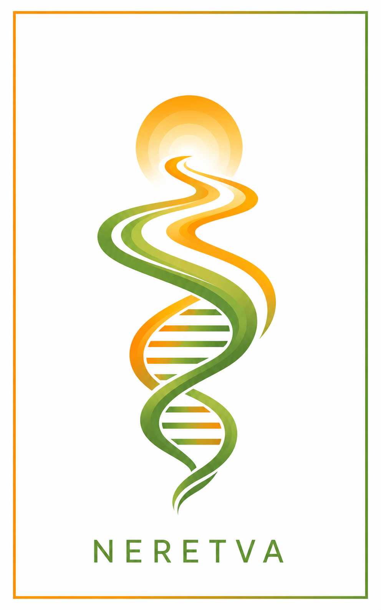

<p align="center">
  
</p>

# Neretva

**Neural Variational Inference for Allele-level Genotyping of Highly Polymorphic Genes**

Neretva is a unified framework that models the genotyping problem as a probabilistic latent variable model and employs auto-encoding variational Bayes (AEVB) for inference. It supports both CYP pharmacogene and KIR gene families, achieving competitive or improved accuracy over existing state-of-the-art tools.

> Zhou Q, Ahmadi SP, Numanagić I. *Neretva: Neural Variational Inference for Allele-level Genotyping of Highly Polymorphic Genes.* Under review, 2026.

---

## Supported Genes

| Family | Genes |
|--------|-------|
| **KIR** | All 17 KIR genes |
| **CYP** | CYP2B6, CYP2C8, CYP2C9, CYP2C19, CYP2D6, CYP3A5|

---

## Installation

### Requirements
- Python ≥ 3.9
- CUDA-compatible GPU (recommended)
- [minimap2](https://github.com/lh3/minimap2) (for KIR genotyping)

### Setup
```bash
pip install https://github.com/0xTCG/neretva.git
```

> **Warning:** some dependencies (such as Aldy) might not work well in Conda environments. Use uv or pip instead.

---

## Usage

### KIR genotyping
```bash
neretva kir --input <bam_path> --mapper <minimap2 path>
```

### Pharmacogene genotyping
```bash
neretva <gene> --input <bam_path> --reference <ref_fasta>
```

### Full options
```
neretva <gene> --input <bam> [options]
```

| Argument | Description |
|----------|-------------|
| `gene` | Gene to genotype: `kir`, `cyp2b6`, `cyp2c8`, `cyp2c9`, `cyp2c19`, `cyp2d6`, `cyp3a5`|
| `--input`| Path to input BAM/CRAM file (required) |
| `--reference`| Path to human reference genome FASTA (required for CYP) |
| `--threads` | Number of threads, default: 16 (KIR only) |
| `--seed` | Random seed, default: 42 |
| `--mapper` | Path to minimap2 binary (KIR only) |

---

## Reproducing Paper Results

See the [`experiments/`](experiments/experiment.ipynb) notebook for full benchmark reproduction, including all tool outputs and evaluation scripts.

---

## Citation

If you use Neretva in your research, please cite:

```bibtex
@article {Zhou2026.02.03.703582,
      author = {Zhou, Qinghui and Ahmadi, Seyed Pouria and Numanagi{\'c}, Ibrahim},
      title = {Neretva: Neural Variational Inference for Allele-level Genotyping of Highly Polymorphic Genes},
      elocation-id = {2026.02.03.703582},
      year = {2026},
      doi = {10.64898/2026.02.03.703582},
      publisher = {Cold Spring Harbor Laboratory},
      URL = {https://www.biorxiv.org/content/early/2026/03/16/2026.02.03.703582},
      eprint = {https://www.biorxiv.org/content/early/2026/03/16/2026.02.03.703582.full.pdf},
      journal = {bioRxiv}
}
```
---

## License

[MIT License](LICENSE)

---
